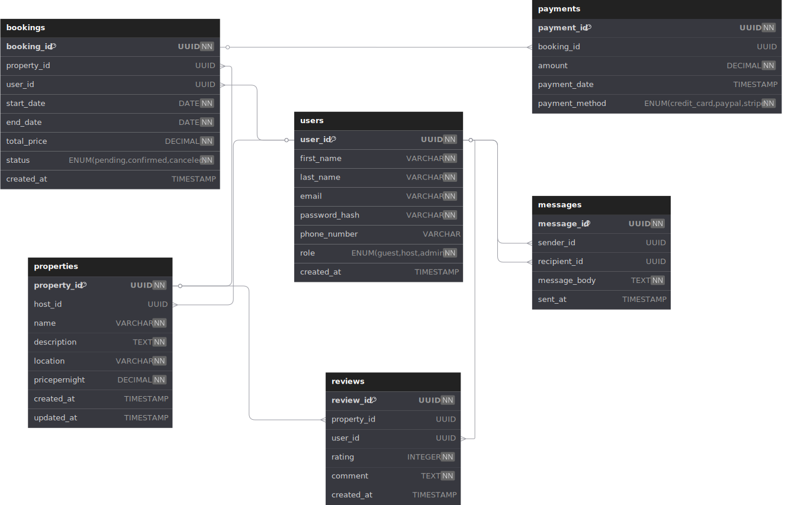

# Entity-Relationship Diagram Requirements

## Entities
1. **User**
   - Attributes: user_id (PK), first_name, last_name, email, password_hash, phone_number, role, created_at

2. **Property**
   - Attributes: property_id (PK), host_id (FK), name, description, location, pricepernight, created_at, updated_at

3. **Booking**
   - Attributes: booking_id (PK), property_id (FK), user_id (FK), start_date, end_date, total_price, status, created_at

4. **Payment**
   - Attributes: payment_id (PK), booking_id (FK), amount, payment_date, payment_method

5. **Review**
   - Attributes: review_id (PK), property_id (FK), user_id (FK), rating, comment, created_at

6. **Message**
   - Attributes: message_id (PK), sender_id (FK), recipient_id (FK), message_body, sent_at

## Relationships
- A User can host many Properties.
- A Property belongs to one User (host).
- A User can make many Bookings.
- A Booking is for one Property and one User.
- A Booking has one associated Payment.
- A User can write many Reviews on Properties.
- A Review is linked to one User and one Property.
- A User can send and receive many Messages.

## Tools
- Diagram created using: [dbdiagram.io](https://app.diagrams.net/)
- File format: PNG
- Location: [View diagram](https://dbdiagram.io/d/681f5ea45b2fc4582f054990) or [Local file](./Airbnb.png)

